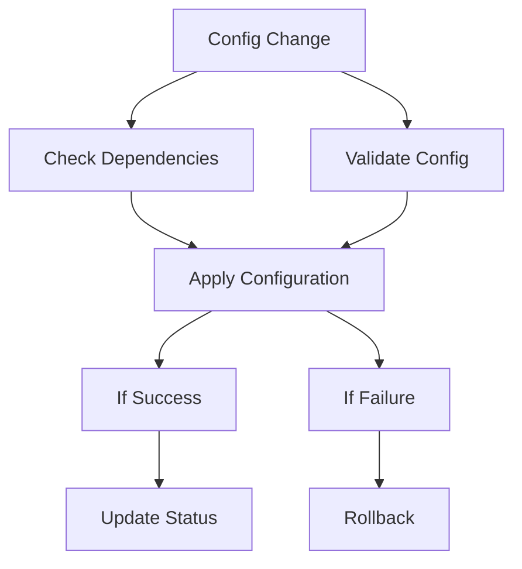

current image in my mind.

In the realm of Identity and Access Management (IAM), Keycloak stands out as a powerful, open-source solution. Yet, managing its configuration—especially in complex, multi-tenant environments—can quickly become a significant bottleneck. Manual changes through the UI, often referred to as “Click-Ops” lead to inconsistent environments, lack of auditability, and high operational overhead.
Multi-tenant SaaS applications face a critical challenge: how to efficiently and securely onboard hundreds or thousands of customers, each requiring their own isolated identity management space. Manual “Click-Ops” in Keycloak simply doesn’t scale, as managing multiple realms for tenants degrades performance and increases complexity.
Enter the KTA (Keycloak Tenant Accelerator) a comprehensive demonstration of how GitOps principles combined with the keycloak-config-cli tool can transform tenant onboarding. This approach automates what was once a manual bottleneck, turning it into a fully automated, auditable, and scalable Configuration as Code (CaC) process.
By leveraging a GitOps workflow, every configuration change is version-controlled and traceable, enabling teams to deploy consistent Keycloak setups across environments with confidence. 

---

## 1. The Legacy Challenge: “Click-Ops” in keycloak and versioning.

**Managing Keycloak manually** is a common starting point, but it presents several challenges that grow with your application's scale.

- **Lack of Versioning:** There is no easy way to track ***who*** changed ***what*** and ***when***. Rolling back a problematic change is a difficult and error-prone process.
- **Environment Inconsistency:** Replicating a configuration exactly from a development environment to a production environment is nearly impossible, leading to the dreaded "it works on my machine" syndrome.
- **Scalability Issues:** Manually onboarding new tenants or services is a time-consuming, repetitive task that doesn't scale.


*Keycloak's Admin Console with a tedious, multi-step process of manually creating and configuring realms.* 

These problems highlight the need for a more systematic, automated, and auditable approach to managing Keycloak's configuration

---

### 2. Keycloak-config-cli: your Key to Declarative Keycloak Management.

This is where the open-source adorsys/keycloak-config-cli tool becomes essential. It's a Java-based command-line utility designed to manage Keycloak's configuration declaratively.

- Core Philosophy: The tool operates on a simple but powerful principle: **the state of your Keycloak realm should match the state defined in your configuration files.** You define everything—realms, clients, roles, users, authentication flows—in YAML or JSON files, and the CLI takes care of making the necessary API calls to Keycloak to make it so.
- Key Feature:
    - **Idempotent Execution**: You can run the CLI with the same configuration file multiple times, and it will only apply changes if there's a drift between your file and the Keycloak state.
    - **Configuration as Code (CaC)**: By storing your YAML/JSON files in Git, you get full versioning, peer reviews for changes (Pull Requests), and a complete audit history.
    - **Powerful Variable Substitution**: The tool allows you to use variables in your configuration files, making it perfect for creating reusable templates. It can substitute values from environment variables, property files, and more.
    - **No Restarts Needed:** Changes are applied live to Keycloak via its Admin API, meaning no downtime is required.
    
    ```bash
     Current directory: /Users/adorsys123/Desktop/dev1.1/personal/pv1/actions-runner/_work/kta/kta
    KTA directory exists: yes
    Script exists: yes
    Tenant file: 'adorsys.yaml'
    Applying specific file: adorsys.yaml
    Ensuring Keycloak is running...
    Using Docker network: kta_kta-network
    Waiting for Keycloak...
    Keycloak is ready!
    Applying specific tenant file: adorsys.yaml
    Running keycloak-config-cli for adorsys.yaml...
    2025-07-01T16:57:55.357Z  INFO 1 --- [           main] d.a.k.config.KeycloakConfigApplication   : Starting KeycloakConfigApplication v6.4.0 using Java 21.0.6 with PID 1 (/app/keycloak-config-cli.jar started by nobody in /)
    2025-07-01T16:57:55.360Z  INFO 1 --- [           main] d.a.k.config.KeycloakConfigApplication   : No active profile set, falling back to 1 default profile: "default"
    2025-07-01T16:57:55.856Z  INFO 1 --- [           main] d.a.k.config.KeycloakConfigApplication   : Started KeycloakConfigApplication in 0.87 seconds (process running for 1.298)
    2025-07-01T16:57:56.357Z  INFO 1 --- [           main] d.a.k.config.KeycloakConfigRunner        : Importing file 'file:/config/tenants/adorsys.yaml'
    2025-07-01T16:57:56.881Z  INFO 1 --- [           main] d.a.k.config.KeycloakConfigRunner        : keycloak-config-cli ran in 00:00.685.
    0s
    ```
    

### 3. The KTA Project: Automated Tenant Onboarding at Scale

The **Keycloak Tenant Accelerator (KTA)** project demonstrates exactly how a real SaaS company can automate the complete lifecycle of tenant onboarding. Let's imagine a project management SaaS called "ConnectFlow" that needs to onboard companies like "x-company" as isolated tenants.

- **The Business Challenge:** When any new tenant signs up for ConnectFlow's services, they need; Their own isolated identity realm `(`{{TENANT_ID}}`)`, Secure web and API clients `(`{{TENANT_ID}}-webapp`, `{{TENANT_ID}}-api`)`, Role-based access control `(`tenant_admin`, `tenant_user`)`, Custom security policies and branding, An initial administrator account to get started.
- Doing this manually for each new customer is unsustainable. The KTA model automates this entire process.
- **Architecture Deep Dive:** From Signup to Running Realm. The workflow demonstrated in the KTA project follows these steps
    - 1.  **Tenant Signup API:** A new tenant fills out a signup form, which hits the Flask backend at `/api/tenants/signup`
    - 2.  **Configuration Generation:** The backend reads the master ``tenant-template.yaml``, substitutes tenant-specific values, and generates ``{{TENANT_ID}}.yaml``
    - 3.  **GitOps Trigger:** The new configuration file is automatically committed and pushed to the Git repository
    - 4.  **CI/CD Activation:** GitHub Actions detects the new file and triggers the deployment pipeline
    - 6.  **Instant Result:** The tenant's dedicated realm is created and ready for their team to use
    
    This entire process takes minutes, not hours or days of manual configuration.
    


### 4. The Template-Driven Approach: Configuration as Code at Scale

The power of the KTA system lies in its template-driven approach to generating tenant configurations. Instead of manually creating each tenant's setup, everything starts with a master blueprint. The master template (`_templates/tenant-template.yaml`) defines the complete structure of a Keycloak realm using placeholder variables.


```yaml
# Tenant Realm Template
realm: "{{TENANT_ID}}"
enabled: true
displayName: "{{TENANT_NAME}} Services"

# Security and Session Configuration
bruteForceProtected: true
accessTokenLifespan: 300  # 5 minutes
ssoSessionIdleTimeout: 1800  # 30 minutes
passwordPolicy: "length(8) and digits(1) and lowerCase(1) and upperCase(1) and specialChars(1)"

# Tenant Applications
clients:
  - clientId: "{{TENANT_ID}}-webapp"
    name: "{{TENANT_NAME}} Web Application"
    enabled: true
    publicClient: true
    redirectUris:
      - "https://{{TENANT_ID}}.kta.app/*"
      - "http://localhost:3000/*"  # For development
    
  - clientId: "{{TENANT_ID}}-api"
    name: "{{TENANT_NAME}} API Client" 
    enabled: true
    publicClient: false
    serviceAccountsEnabled: true
    secret: "{{TENANT_ID}}-api-secret-change-me"

# Role-Based Access Control
roles:
  realm:
    - name: "tenant_admin"
      description: "Administrator role for {{TENANT_NAME}} tenant"
    - name: "tenant_user"
      description: "Standard user role for {{TENANT_NAME}} tenant"

# Multi-tenant Protocol Mappers
protocolMappers:
  - name: "tenant-id-mapper"
    protocol: "openid-connect"
    protocolMapper: "oidc-hardcoded-claim-mapper"
    config:
      "claim.name": "tenant_id"
      "claim.value": "{{TENANT_ID}}"
```

- How the Template System Works: *When a tenant with ID "acme_corp" and name "ACME Corporation" signs up, the template becomes:*

```yaml
# Generated tenants/acme_corp.yaml
realm: "acme_corp"
displayName: "ACME Corporation Services"
clients:
  - clientId: "acme_corp-webapp"
    name: "ACME Corporation Web Applic ation"
    redirectUris:
      - "https://acme_corp.kta.app/*"
protocolMappers:
  - config:
      "claim.value": "acme_corp"
```

- Notice how every element is scoped to the specific tenant:
    - **Realm isolation:** Each `{{TENANT_ID}}` realm is completely separate from other tenants
    - **Custom applications:** `{{TENANT_ID}}-webapp` and `{{TENANT_ID}}-api` belong only to that tenant
    - **Tenant-aware tokens:** JWT tokens include `tenant_id: "{{TENANT_ID}}"` claims for application-level authorization
    - **Security policies:** Each tenant can have their own paxssword requirements and session timeouts

This level of isolation ensures that each tenant's users, applications, and data remain completely separate from other tenants on the same Keycloak server.


### 5. CI/CD Pipeline: From Configuration to Deployment

Our  Actions workflow automates the entire process from tenant configuration changes to deployment in Keycloak. This ensures consistency and reliability across all tenant deployments.

### The Pipeline in Detail:

- **Configuration Detection:**

  Monitors changes in ``keycloak-configs/tenants/*.yaml`` files to trigger the deployment process.

- **Validation Process:**

  Validates YAML syntax and tenant configuration structure before proceeding.

- **Deployment Orchestration**

  Handles the configuration application through Keycloak Config CLI with proper error handling



This automation yields powerful results, enabling seamless tenant management:


*tool logs demonstrating successful realm creation and updates*

Example CI setup for Production.

```yaml
name: Apply Keycloak Tenant Configurations

on:
  push:
    branches:
      - main
      - master
    paths:
      - 'keycloak-configs/tenants/**/*.yaml'
      - 'keycloak-configs/tenants/**/*.yml'
  
  # Allow manual triggering
  workflow_dispatch:
    inputs:
      tenant_id:
        description: 'Specific tenant ID to deploy (optional - leave empty for all)'
        required: false
        type: string

jobs:
  validate-configs:
    name: Validate Configuration Files
    runs-on: ubuntu-latest
    outputs:
      configs-valid: ${{ steps.validate.outputs.valid }}
      tenant-files: ${{ steps.find-files.outputs.files }}
    
    steps:
      - name: Checkout repository
        uses: actions/checkout@v4
      
      - name: Set up Python
        uses: actions/setup-python@v4
        with:
          python-version: '3.11'
      
      - name: Install PyYAML
        run: pip install PyYAML
      
  deploy-to-keycloak:
    name: Deploy Configurations to Keycloak
    runs-on: ubuntu-latest
    needs: validate-configs
    if: needs.validate-configs.outputs.configs-valid == 'true'
    
    steps:
      - name: Checkout repository
        uses: actions/checkout@v4
      
      - name: Create temporary config directory
        run: |
          mkdir -p /tmp/keycloak-configs
          files="${{ needs.validate-configs.outputs.tenant-files }}"
          echo " Files to process: $files"
          
          for file in $files; do
            if [ -f "$file" ]; then
              filename=$(basename "$file")
              cp "$file" "/tmp/keycloak-configs/$filename"
              echo "Copied $file → /tmp/keycloak-configs/$filename"
            else
              echo "File not found: $file"
            fi
          done
          
          echo "Contents of /tmp/keycloak-configs/:"
          ls -la /tmp/keycloak-configs/
          echo "File count: $(ls -1 /tmp/keycloak-configs/*.yaml /tmp/keycloak-configs/*.yml 2>/dev/null | wc -l)"
      
      - name: Validate Keycloak Connection Settings
        run: |
          echo "Validating Keycloak connection settings..."
          if [ -z "${{ secrets.KEYCLOAK_URL }}" ]; then
            echo " Error: KEYCLOAK_URL secret not set"
            echo "Please set the following repository secrets:"
            echo "  - KEYCLOAK_URL (e.g., https://your-keycloak.com or https://xxxx.ngrok.io)"
            echo "  - KEYCLOAK_ADMIN_USER (e.g., admin)"
            echo "  - KEYCLOAK_ADMIN_PASSWORD (e.g., your-password)"
            exit 1
          fi
          echo " Keycloak URL: ${{ secrets.KEYCLOAK_URL }}"
          echo "Admin User: ${{ secrets.KEYCLOAK_ADMIN_USER }}"
          echo "Credentials configured"

      - name: Apply Keycloak Configurations
        run: |
          echo "Starting Keycloak configuration deployment..."
          echo "Available files in /config:"
          ls -la /tmp/keycloak-configs/
          
          docker run --rm \
            -v /tmp/keycloak-configs:/config \
            -e KEYCLOAK_URL="${{ secrets.KEYCLOAK_URL }}" \
            -e KEYCLOAK_USER="${{ secrets.KEYCLOAK_ADMIN_USER }}" \
            -e KEYCLOAK_PASSWORD="${{ secrets.KEYCLOAK_ADMIN_PASSWORD }}" \
            -e KEYCLOAK_AVAILABILITYCHECK_ENABLED=true \
            -e KEYCLOAK_AVAILABILITYCHECK_TIMEOUT=120s \
            -e IMPORT_FILES_LOCATIONS='/config/*.yaml' \
            -e IMPORT_VAR_SUBSTITUTION_ENABLED=false \
            -e IMPORT_CACHE_ENABLED=false \
            -e LOGGING_LEVEL_KEYCLOAKCONFIGCLI=INFO \
            adorsys/keycloak-config-cli:latest
```

This setup provides a robust foundation for managing multiple tenants through version control. The pipeline ensures that configuration changes are properly validated and applied, with automatic rollback in case of failures.

---

### 6. Evolution: Keycloak Organizations - The Future of Multi-Tenancy

### The Organization Revolution:

While the realm-per-tenant approach demonstrated above provides excellent isolation, Keycloak 26+ introduces a game-changing feature: **Organizations** This native multi-tenancy solution offers a more scalable and efficient approach to managing multiple tenants within a single realm. 

Realm-per-Tenant vs Organizations: A Comprehensive Comparison: 

| `Aspect` | `Realm-per-Tenant` | `Organizations` |
| --- | --- | --- |
| Scalability | performance issues becoming noticeable around 400 and potentially rendering system unstable | Virtually unlimited organizations  |
| Resource Usage | High (each realm has overhead) | Low (shared realm infrastructure) |
| Cross-tenant Features | Complex to implement |  Built-in identity-first login |
| Administration | Multiple realm management | Single realm with organization delegation |
| SSO Scenarios | Limited cross-realm SSO |  Native cross-organization SSO |
| Domain-based Routing | Manual implementation | Built-in domain-to-organization mapping |

The KTA system manage Keycloak Organizations using a **fully declarative, GitOps-driven workflow**. This approach abandons direct API calls for organization creation in favor of the same powerful `keycloak-config-cli` methodology used for realm-per-tenant management. The result is a single, consistent, and auditable process for all multi-tenancy models..

This new architecture is simpler and more robust. The backend's only role is to render a complete configuration file from a template and commit it to Git. The CI/CD pipeline handles the deployment declaratively.


kta organization: Declarative GitOps Flow

The core of this new approach is a set of self-contained configuration files to reprensent your desire state, this is purely owesome.

**1. The Organizations Realm Template (`_templates/organizations-realm-template.yaml`)**

First, a base realm is defined to host all organizations. This is a one-time setup.

```yaml
# KTA Organizations Realm Template
# This template creates a single realm that will host multiple organizations.
# Organizations are defined in separate files and merged at apply-time.

realm: "kta-organizations"
enabled: true
displayName: "KTA Multi-Tenant Organizations"

# Enable Organizations feature
attributes:
  "organizationsEnabled": "true"

# Other realm settings...
registrationAllowed: false
registrationEmailAsUsername: true
rememberMe: true
verifyEmail: true
loginWithEmailAllowed: true
duplicateEmailsAllowed: false
resetPasswordAllowed: true
editUsernameAllowed: false
bruteForceProtected: true
accessTokenLifespan: 300
ssoSessionIdleTimeout: 1800
ssoSessionMaxLifespan: 36000
internationalizationEnabled: true
supportedLocales:
  - "en"
  - "fr"
  - "es"
  - "de"
defaultLocale: "en"
passwordPolicy: "length(8) and digits(1) and lowerCase(1) and upperCase(1) and specialChars(1)"
eventsEnabled: true
eventsListeners:
  - "jboss-logging"
adminEventsEnabled: true
adminEventsDetailsEnabled: true

# Realm-level roles for organization management
roles:
  realm:
    - name: "org_admin"
      description: "Organization administrator role"
    - name: "org_manager"
      description: "Organization manager role"
    - name: "org_user"
      description: "Organization user role"
    - name: "org_viewer"
      description: "Organization viewer role"
    - name: "kta_super_admin"
      description: "KTA super administrator - can manage all organizations"

# Placeholder for organizations.
# This list will be populated by merging individual organization config files.
organizations: [] 
```

**2. The Jinja2 Organization Template (`_templates/organization-template.yaml.j2`)**

This is the master blueprint for a ***single*** organization. It's a `.j2` file, signifying it as a Jinja2 template, which prevents conflicts with YAML linters. The backend renders this template to produce a complete YAML file.

```yaml
# KTA Organization Template
# This template creates a self-contained configuration file for a single organization
# that can be directly applied by keycloak-config-cli.

realm: "kta-organizations"
organizations:
  - name: "{{ org_name }}"
    alias: "{{ org_alias }}"
    enabled: true
    description: "Organization for {{ org_name }}"
    attributes:
      industry:
        - "{{ industry | default('Technology') }}"
      region:
        - "{{ region | default('Global') }}"
    domains:
      
      - name: "{{ domain.name }}"
        verified: {{ domain.verified | default(false) | tojson }}
      
    members:
      - username: "{{ admin_email }}"
        firstName: "{{ admin_first_name }}"
        lastName: "{{ admin_last_name }}"
        email: "{{ admin_email }}"
        enabled: true
        realmRoles:
          - "org_admin" 
```

**3. The Generated configuration  (**`organizations/acme-corp.yaml`**)**

When a user signs up, the backend generates a complete, self-contained YAML file like this. Note that it specifies the target realm (`kta-organizations`) and contains all necessary organization details.

```yaml
realm: "kta-organizations"
organizations:
  - name: "Acme Corporation"
    alias: "acme-corp"
    enabled: true
    description: "Organization for Acme Corporation"
    attributes:
      industry:
        - "Manufacturing"
      region:
        - "North America"
    domains:
      - name: "acme-corp.com"
      - name: "acme.com"
    members:
      - username: "admin@acme-corp.com"
        firstName: "John"
        lastName: "Doe"
        email: "admin@acme-corp.com"
        enabled: true 
```


**3. CI/CD Pipeline  (`.github/workflows/apply-organizations-config.ym**l`**)**

The GitHub Actions workflow is now extremely streamlined. It triggers on a push to the `organizations` directory and executes a single script.

```bash
apply_all_org_configs() {
    print_info "Applying all organization configurations..."
    
    if [ ! -d "$ORGS_DIR" ] || [ -z "$(ls -A "$ORGS_DIR")" ]; then
        print_info "No organization files found in $ORGS_DIR. Nothing to apply."
        return
    fi

    for file in "$ORGS_DIR"/*.yaml; do
        if [ -f "$file" ]; then
            filename=$(basename "$file")
            print_info "Applying organization config: $filename"
            
            docker run --rm \
                --network "$NETWORK_NAME" \
                -v "$ORGS_DIR:/config/organizations" \
                -e KEYCLOAK_URL="$KEYCLOAK_URL" \
                -e KEYCLOAK_USER="$KEYCLOAK_USER" \
                -e KEYCLOAK_PASSWORD="$KEYCLOAK_PASSWORD" \
                -e IMPORT_FILES_LOCATIONS="/config/organizations/$filename" \
                -e IMPORT_VAR_SUBSTITUTION_ENABLED=false \
                -e LOGGING_LEVEL_DE_ADORSYS_KEYCLOAK_CONFIG_CLI=INFO \
                "$KEYCLOAK_CONFIG_CLI_IMAGE"
        fi
    done

    print_status "All organization configurations applied."
}
```


**4. Summary of new approach** 

- This purely declarative GitOps workflow provides immense benefits:
    - **Single Source of Truth:**  The Git repository is the undisputed source of truth for all organization configurations.
    - **Audibility**:  Every change is a Git commit, providing a complete history of who changed what and when.
    - **Consistency:** The same script and container are used for deployment everywhere, eliminating environment drift.
    - **Simplicity:** The logic is straightforward and easy to understand, with no complex merging or direct API calls in shell scripts.
1. When to Use Organization vs Realm-per-Tenant
    
    
    | Choose Organizations when | Choose Realm-per-Tenant when |
    | --- | --- |
    | Managing 50+ tenants | Need maximum isolation |
    | Need cross-tenant user sharing |  Have complex per-tenant customizations |
    | Require domain-based routing |  Require different authentication flows per tenant |
    | Want simplified administration | Regulatory compliance demands complete separation |
    | Plan for massive scale (1000+ tenants) | Managing <50 tenants with stable requirements |

### 7. Migration Strategy: KTA methodology + Organizations

The KTA project demonstrates how organizations can gradually migrate from realm-per-tenant to Organizations:


from Realms to Organizations.

---

### 8. Demonstration Resources

To implement this solution in your environment, refer to these key resources:

**Setup and Installation**
   - [[Keycloak Docker Setup Guide](https://www.keycloak.org/getting-started/getting-started-docker)]
   - [[Keycloak Config CLI Repository](https://github.com/adorsys/keycloak-config-cli)]

**Configuration Examples

   - [[Kta implimentation example](https://github.com/AssahBismarkabah/kta)]
   - [**Keycloak Realm Configuration** Guide](https://www.keycloak.org/docs/latest/server_admin/#core-concepts-and-terms)
   - [[GitHub Actions Workflow Examples](https://docs.github.com/en/actions/examples)]
   - [[Docker Compose Documentation](https://docs.docker.com/compose/)]

---

### 9.  Future Enhancements, Performance and Scalability Considerations

Multi-Environment Support, advance valiation, monitoring and reporting

- Environment-specific configuration templates
- Automated environment detection and configuration switching
- Integration with cloud provider secrets management
- Custom validation rules for tenant configurations
- Deployment status notifications
- Performance metrics collection
- Caching strategies for repeated configurations
- Incremental updates vs. full deployments

---

### 10. Best Practices and Practical Tips

- Version Control
    - Use semantic versioning for configurations
      Maintain a changelog
      Implement review processes for configuration changes
- Security
    - Regular security audits
     Principle of least privilege
     Secure storage of sensitive configurations

  Example secure configuration:

```yaml
   # tenant-security.yaml
   realm: "{{TENANT_ID}}"
   bruteForceProtected: true
   failureFactor: 3
   waitIncrementSeconds: 60
   maxFailureWaitSeconds: 900
   maxDeltaTimeSeconds: 43200
   passwordPolicy: "length(12) and digits(2) and upperCase(1) and lowerCase(1) and specialChars(1)"
   
   # Client configuration with secure defaults
   clients:
     - clientId: "{{TENANT_ID}}-api"
       secret: "${ENV_CLIENT_SECRET}"  # Loaded from environment
       publicClient: false
       directAccessGrantsEnabled: false
       serviceAccountsEnabled: true
       standardFlowEnabled: false
       implicitFlowEnabled: false
```

- Maintenance
    - Regular backup procedures
     Monitoring and alerting setup
     Documentation updates

```yaml
   # prometheus-rules.yaml
   groups:
     - name: keycloak_alerts
       rules:
         - alert: KeycloakHighFailedLogins
           expr: rate(keycloak_failed_login_attempts[5m]) > 10
           labels:
             severity: warning
         - alert: KeycloakConfigUpdateFailed
           expr: keycloak_config_cli_status{status="failed"} > 0
           labels:
             severity: critical
```

### 11.  Additional Resources and Further Reading

For those interested in exploring further, here are some valuable resources:

- **What is ClickOps, and How Can You Prevent It?:** https://blog.equinix.com/blog/2022/12/01/what-is-clickops-and-how-can-you-prevent-it/
- **Fairness in multi-tenant systems:** https://aws.amazon.com/builders-library/fairness-in-multi-tenant-systems/
- keycloak configuration change management discussion:[https://github.com/keycloak/keycloak/discussions/19782](https://github.com/keycloak/keycloak/discussions/19782)
- All keycloak Configuration: https://www.keycloak.org/server/all-config
- Configuration as code: https://www.keycloak.org/server/all-config
- Keycloak 26.x documentation: [https://www.keycloak.org/docs/latest/release_notes/index.html#keycloak-26-1-0](https://www.keycloak.org/docs/latest/release_notes/index.html#keycloak-26-1-0)
- what is GitOps: [https://about.gitlab.com/topics/gitops/](https://about.gitlab.com/topics/gitops/)

### 10. Conclusion

The implementation of automated Keycloak tenant configuration using GitHub Actions represents a significant advancement in managing multi-tenant environments. This solution not only streamlines the deployment process but also ensures consistency, security, and scalability. By following the best practices and considering future enhancements, organizations can build a robust and efficient tenant management system.

Thanks for sticking with me till the end, and I hope this deep dive inspires you to explore new ways to modernize your own projects! Feel free to contribute to the [project](https://github.com/AssahBismarkabah/kta), share your experiences, or reach out with questions. Together, we can continue to improve and evolve the way we manage identity and access in our applications.