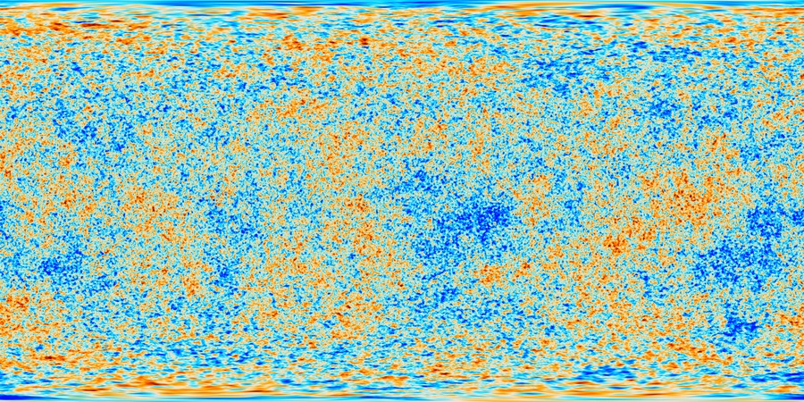

The observable universe is about 93 billion light-years across. That sounds like an answer to "how big is the universe?" but it isn't. It's how far light has had time to travel since the Big Bang, 13.8 billion years ago. We're trapped inside a bubble of light, and the edge of that bubble is the farthest back in time we can see.

That edge has a name. The Cosmic Microwave Background is a wall of ancient light surrounding us in every direction, the afterglow of the Big Bang. Before that point the universe was opaque, like fog. We can't see past it.

So we've found the edge of our vision. But we haven't found the edge of the universe. If you could teleport to the boundary of our observable bubble, you'd most likely just see more universe. You'd be in the center of your own new bubble, seeing galaxies invisible to us back on Earth. Most evidence suggests the universe is flat and extends in all directions, possibly infinitely. It might also curve back on itself like the surface of a sphere, or our entire universe might be one bubble in a larger cosmic foam. We don't know.

## expanding into non-existence

That "more universe" answer sounds reasonable until you ask what the universe is expanding into. The answer is nothing. Not empty space, not a void. Non-existence.

We tend to imagine it like a balloon inflating inside a room. But there is no room. The universe doesn't move outward through space. It creates space. Draw two dots on a rubber band and stretch it. The dots move apart, not because they're walking, but because there's physically more rubber between them now. That's what's happening to galaxies. The space between them is being manufactured from scratch. "Outside" the universe isn't dark or empty. It isn't anything. The concept doesn't apply.

## how it dies

Since there's no edge in space, the "end" doesn't happen at a boundary. It happens in time.

The most likely scenario is the Big Freeze. The universe keeps expanding forever. Stars burn through their fuel and die. New stars stop forming because gas is too spread out to collapse under gravity. Eventually everything goes dark, cold, and silent. The universe just goes quiet and stays that way.

The expansion could also accelerate until it rips apart galaxies, then stars, then atoms. Or gravity could eventually win and pull everything back into a single point. But the current evidence points to the freeze. A slow fade with no one left to notice.

## the scale problem

When you actually sit with this, a universe that's 93 billion light-years of mostly radioactive vacuum slowly fading into cold silence, the idea of a personal God watching over one species of primate on one tiny rock starts to feel incredibly small.

If the goal was to create humans, 99.9999% of the universe would kill us instantly. It looks less like a nursery built for us and more like a chaotic explosion where we happened to survive on one speck of it. And historically, every gap in our understanding that we filled with "God," lightning, disease, the sun moving across the sky, eventually got a physical explanation. If the Big Bang happened naturally, if expansion runs on dark energy, if stars burn by fusion, the role for a creator keeps shrinking.

That's the logic that makes skepticism feel obvious at cosmic scale.

## the counter that won't go away

But some astrophysicists look at the exact same void and see the opposite.

The math of the universe is terrifyingly precise. If the force of gravity were slightly stronger, the universe would have crushed itself instantly after the Big Bang. Slightly weaker, and stars would never have formed. The expansion speed was calibrated to within a margin so small the number is hard to write down. Change it by a fraction and you don't get galaxies, planets, or chemistry complex enough to produce life.

This is the Fine-Tuning Problem. Skeptics call it survivorship bias: we're here because it happened, and if it hadn't we wouldn't be around to notice. Others say the odds are too absurdly low for accident. It looks rigged. Same evidence, completely different reading.

## something from nothing

The tension gets sharper one step further in. Science says the universe had a beginning. Before the Big Bang, there was no time, no space, no matter.

Theology looks at that and says it sounds exactly like creation ex nihilo, creation out of nothing. If the laws of physics didn't exist before the universe, then a law of physics couldn't have caused the universe. Something outside of nature had to start it.

The skeptic's response is clean: if we can accept a God that was never created, why can't we just accept a universe that was never created? Why add the extra step?

## the regress

If the Big Bang was caused by a quantum vacuum or an energy field, where did that field come from? If God created the universe, who created God?

Some physicists, like Sean Carroll, argue that the universe might just be. It doesn't need a "why." It's a brute fact, something that exists without a prior reason. Causality, the idea that A always leads to B, might only work inside our universe, not before it.

Others point to quantum mechanics. On tiny scales, particles pop in and out of existence from nothing all the time. Maybe the Big Bang was a massive version of that. But even a quantum vacuum isn't "nothing." It's a field governed by laws. So who wrote the laws that allowed the fluctuation? You're back to the same question.

Theologians say there must be an uncaused first cause that exists outside of time. Since time started at the Big Bang, this cause doesn't need a beginning. It exists in what they call an eternal now. But then the skeptic asks again: if something can exist without a cause, why does it have to be God and not the universe itself?

Some newer models suggest the universe has no beginning at all. It's an endless cycle of expansion and collapse, Big Bang after Big Bang, forever. A loop with no starting point. But even a loop needs an explanation for why the loop exists.

Every answer here collapses back into the same question. You solve one layer and find another underneath.

## three people, same evidence

Einstein, Hawking, and Planck all spent their lives staring at this and landed in completely different places.

Einstein rejected a personal God, the kind who listens to prayers or judges behavior. He called that idea childlike. But he wasn't an atheist either. He compared humanity to a small child entering a massive library filled with books in languages the child can't read. The child senses a mysterious order in how the books are arranged but can't understand the plan behind it. When Einstein said "God," he meant the harmony of natural laws. The fact that the universe follows mathematical rules at all was, to him, the miracle.

Hawking went further. He argued that because laws like gravity exist, the universe can and will create itself from nothing. Asking what came before the Big Bang, he said, is like asking what's south of the South Pole. If time itself started at the Big Bang, there was no "before" for any creator to exist in.

Planck went the other direction entirely. After spending his life studying the atom, the father of quantum physics concluded that there is no matter as such. All matter originates from a force that holds atoms together, and behind that force, he said, we must assume the existence of a conscious and intelligent Mind. He called this mind the "matrix of all matter."

Three of the most important physicists in history. Same universe, same equations. Three incompatible conclusions about what it means.

We don't know if the universe has an edge or goes on forever. We don't know if life exists anywhere else, and even if it does, our fastest spacecraft would take millions of years to reach the nearest candidates. We can predict how quantum fields behave with math, but we have no idea why the fields exist or what triggers particles to pop into existence from nothing. We don't know what caused the Big Bang, and every attempt to answer it produces another question with the same shape.

We don't know if religious experience is psychology or witness. People died for what they believed, and we can't tell if they saw something real or if the human brain is just capable of generating that kind of certainty on its own. We don't know where consciousness originates or what it fundamentally is. We don't know how the universe ends.

None of this has changed what I believe. But it hasn't settled the questions either. Every answer I've followed has opened into something bigger, and at the bottom there isn't a floor. The people who wrote the equations couldn't agree, and the rest of us are working with even less.
