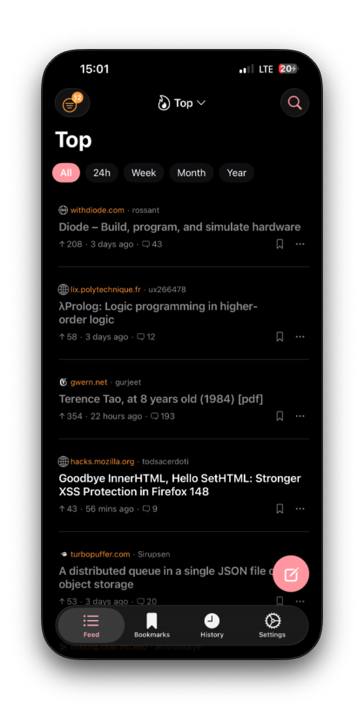
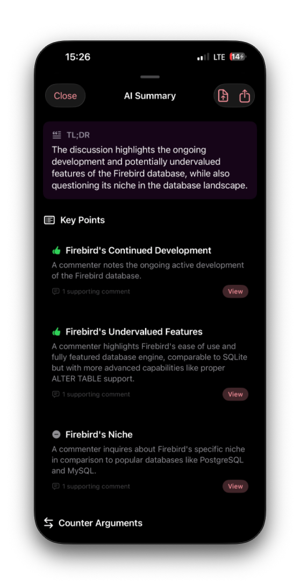
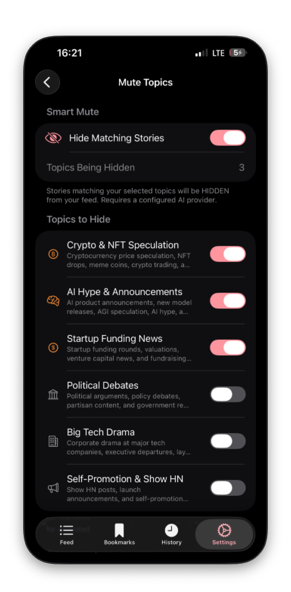
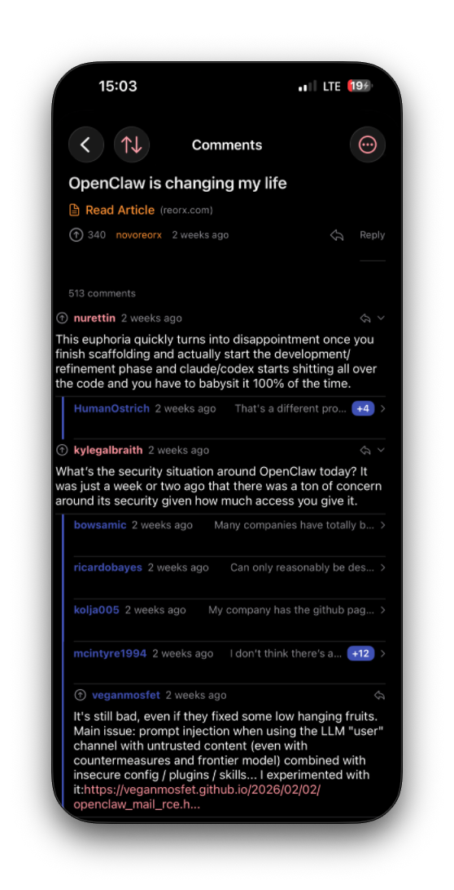

[Hacker News](https://news.ycombinator.com/) is where the best technical conversations happen. When a new database gets traction, the thread on HN is where the people who actually built competing systems show up and explain the tradeoffs. When a paper drops, the comments are often better than the paper. The signal is real and it's consistently better than anything else in tech.

But getting that signal out is expensive. A good HN thread runs 300 comments. Maybe 15 of them contain the actual insight. The rest is tangential debate, someone relitigating a language war from 2019, jokes. You have to read through all of it to find the 15 that matter. On mobile it's worse. The default site barely works on a phone screen, the thread structure is hard to follow, and you're doing this on a device built for quick interactions, not deep reading.

So I was spending close to an hour a day just staying current. Not reading for depth. Triage. Scrolling, skimming, trying to figure out which threads matter and which ones I can skip. Something that should take 10 minutes was taking six times that.

## The wrong problem

There are good HN clients. [Harmonic](https://github.com/nicklawls/Harmonic), the [Algolia](https://hn.algolia.com/) interface, various iOS and Android readers. Better typography, dark mode, gesture navigation. Some of them are genuinely well built.

But they all solve the wrong problem. They make it easier to read 300 comments. I've [written before](/docs/blog/hacker-news) about using Algolia and SQL tricks to sort HN threads by most recent comments. That helps, but it's still you doing the reading. The actual problem is that you shouldn't have to read 300 comments to get the point. A nicer reader doesn't reduce the volume. It just makes the volume more comfortable to sit in.

## What I built instead

[Decidel](https://decidel.app/) started from one idea: staying updated with what's happening in tech should be frictionless and clear. Not easier reading. Less reading. Not a better HN client. Signal extraction.

In practice that means three things.

First, summarization. You open a thread and get the key points, the counter-arguments, and which comments are actually worth reading. Not a chatbot. A compressed view of what 200 people said, structured so you can absorb it in 30 seconds and decide if you want to go deeper. The AI pulls out the positions, the disagreements, the expert takes, and links each one back to the source comment.

Second, semantic filtering. Not keyword blocking. AI classification that understands what a thread is actually about and whether it matches topics you don't care about. Crypto speculation, startup funding drama, political debates. You configure what gets filtered and matching threads don't show up. This is different from a recommendation algorithm. It doesn't decide what you should read. It removes what you already know you don't want.

Third, offline bundles. You package stories and their summaries for reading without connectivity. Train, plane, subway. The update happens on your schedule, not your network's.

All three come from the same place. Reduce the gap between "I want to know what's happening" and "now I know," without throwing away the depth that makes HN worth reading.

## How the AI works

The AI is the mechanism, not the product. Decidel has a pluggable provider architecture. An `AIProvider` protocol that any backend can conform to, and the app currently supports [Groq](https://groq.com/), [OpenAI](https://openai.com/), [Anthropic](https://www.anthropic.com/), and [Google Gemini](https://deepmind.google/technologies/gemini/). You bring your own API key. It's stored locally in the iOS Keychain and sent directly to the provider. The app never touches a server with your key.

I went with bring-your-own-key because I don't want to eat API costs and because AI pricing changes constantly. Three providers changed their pricing in six months while I was building this. If you lock users into one provider and that provider doubles their rates, your app just got expensive for everyone. With BYOK the user picks the provider and model that fits their budget.

The summarization pipeline itself is simple. Filter out deleted comments, cap at 100 to avoid blowing the context window, format into a structured prompt, get JSON back with key points, counter-arguments, source links, and a TLDR. Cache for 24 hours. Invalidate when the comment count changes significantly so you're not burning tokens every time you revisit a thread.

Semantic filtering works the same way. Story titles and URLs go to the AI with a classification prompt. The AI scores each story against your configured filter concepts. Matches get hidden. The built-in concepts cover the common noise: crypto speculation, funding rounds, political debates, big tech drama, AI hype announcements, self-promotion.

## What I didn't build

No chat feature. When you have 300 comments from domain experts arguing about database internals, the useful thing isn't another voice in the room. It's a map of who said what and where they disagree. That's [taste and judgment](/docs/blog/taste-judgment-ai). Knowing what not to build matters more than what you build. Summarization is compression. Chat is more noise.

No recommendation algorithm. The app doesn't learn what you like and feed you more of it. That's engagement optimization, not information. Decidel shows HN's feed and lets you subtract. You control the filter, not an algorithm.

No AI-generated content. The app doesn't write comments or produce anything that goes back into HN. It reads and compresses. The whole point is reducing noise, not contributing to it.

## Where it is now

Decidel is on the [App Store](https://apps.apple.com/us/app/decidel/id6759561178). The free tier gives you 15 summaries per day and 3 filter concepts. Pro unlocks unlimited usage and provider switching. It also runs on iPad and macOS. A web version crossed my mind, but the problem I was solving is fundamentally a mobile one. This is where people check what's happening on the go, between tasks, on the train. Desktop HN is tolerable. Mobile HN is where the friction actually lives.

HN is still the best place to find out what's actually moving in tech. The conversations are still high quality. But the cost of extracting that quality is still too high for a daily routine. An hour of triage for 10 minutes of insight is a broken ratio. That's the problem Decidel exists to fix.
