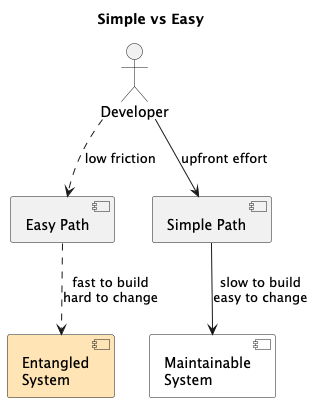
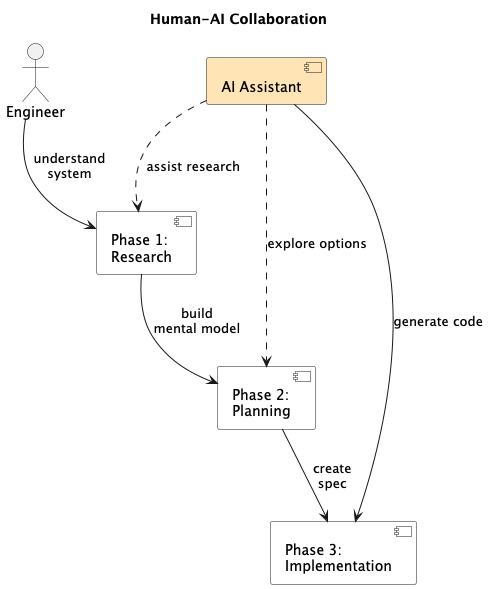

# The Infinite Software Crisis: What Happens When AI Writes Faster Than We Can Think

There's been a lot of talk lately about what's being called the ["Infinite Software Crisis"](https://www.youtube.com/watch?v=eIoohUmYpGI). It's not a new observation - people have been warning about this for a while - but it's been circulating more in engineering circles recently, and I've been sitting with it trying to figure out what it actually means for how I work.

The core idea: AI can now generate code faster than we can understand it. Not just faster than we can write it - faster than we can *comprehend* what's being produced. That gap? That's the crisis everyone's talking about.

And yeah, I'm starting to see it. In my own work. In code reviews. It's real.

## We've been here before

This isn't the first time software has outpaced our ability to manage it. The original ["software crisis" was identified in 1968](https://en.wikipedia.org/wiki/Software_crisis) at a NATO conference - demand was growing faster than our ability to deliver reliable software. Every generation since has hit a similar wall and responded with new tools: [structured programming](https://en.wikipedia.org/wiki/Structured_programming) in the 70s, [object-oriented design](https://en.wikipedia.org/wiki/Object-oriented_programming) in the 80s-90s, [Agile](https://agilemanifesto.org/) in the 2000s, [DevOps](https://en.wikipedia.org/wiki/DevOps) in the 2010s.

Each wave solved some problems and created new ones. The pattern repeats. But AI code generation is different in scale - tools like [GitHub Copilot](https://github.com/features/copilot), [Claude](https://claude.ai), and [Cursor](https://cursor.sh) can generate code as fast as we can describe it. The volume is essentially infinite. That's new.

## The Easy vs Simple trap (and why AI makes it worse)

There's a distinction between [`easy` and `simple`](https://www.infoq.com/presentations/Simple-Made-Easy/) that keeps coming back to me in this context. I used to think it was just nitpicking semantics. It's not. This is the heart of the problem.

**Easy** = close at hand, low friction, easy to reach for. Copy from [Stack Overflow](https://stackoverflow.com). Import another library. Ask the LLM to generate it.

**Simple** = not entangled, boundaries are clear, one thing does one thing. Hard to achieve. Needs planning.

Here's what I've learned the hard way: when you chase `easy` without also chasing `simple`, that's how you end up drowning in [technical debt](https://martinfowler.com/bliki/TechnicalDebt.html). Every time. And AI is the ultimate easy button. It's optimized for "here's code that might work" not "here's code that fits cleanly into your architecture."

The AI doesn't know your system. It doesn't know why that weird pattern is in your auth layer. It just sees patterns and replicates them - including all the mistakes.

*The path of least resistance (Easy) leads to entangled systems. Deliberate design (Simple) takes more effort upfront but you can actually maintain the thing.*

## Essential vs Accidental Complexity

There's a framework from 1987 called ["No Silver Bullet"](https://worrydream.com/refs/Brooks_1986_-_No_Silver_Bullet.pdf) that's still the best lens for thinking about this - the distinction between essential and accidental complexity.

**Essential complexity** = the problem is actually hard. [Distributed transactions](https://en.wikipedia.org/wiki/Distributed_transaction) are complex because distributed systems are complex. You can't simplify this away.

**Accidental complexity** = the tools and abstractions we layer on top. ORM magic. Framework conventions. That weird pattern someone added in 2019 because they read a blog post.

The problem? In any real codebase, essential and accidental complexity are tangled together. And AI can't tell them apart. It looks at your codebase and thinks "this is how things are done here" - including all the historical workarounds, all the tech debt, all the patterns that made sense five years ago but don't anymore.

So when you ask AI to generate more code, it faithfully replicates and *scales* your accidental complexity. It's not reducing the mess. It's accelerating it.

### A pattern I keep seeing

Authentication refactors. Everyone has one. You've got some legacy auth system that's grown tentacles into every [microservice](https://martinfowler.com/articles/microservices.html). Business rules mixed with authorization logic. The whole thing is load-bearing spaghetti.

You think: "AI will help me untangle this!"

But the AI looks at your tangled mess and generates more tangled code that fits right in. It can't see the architectural seams because there aren't any clean seams to see. It can generate patterns. It can't *discern* when patterns are broken.

## How I'm trying to work with AI (without drowning)

I've been experimenting with what I'm calling "context compression" - basically front-loading all the human thinking before I let AI generate anything substantial. This is similar to what others call ["spec-driven development"](https://www.youtube.com/watch?v=eIoohUmYpGI) - the idea that thinking and planning should be the majority of the work, not the code generation.

*The majority of intellectual effort happens before code generation, not after.*

### Phase 1: Research and context compression

This is where I spend most of my time now. Before I write any prompts for code generation, I need to actually understand the system.

**What I do:**
- Dig through the codebase manually
- Read the incident reports
- Look at the architectural diagrams (if they exist)
- Sometimes even search Slack history for why certain decisions were made

**What AI helps with:**
- Mapping dependencies
- Summarizing large docs
- Answering specific questions about the code

But I'm validating everything. The AI is my research assistant, not my source of truth. I'm building a mental model, correcting the AI's interpretation when it's wrong, injecting all the context that isn't written down anywhere.

### Phase 2: Planning the architecture

This is where I make the decisions. Clean service boundaries. API contracts. Data models. Function signatures.

The goal is to produce a spec so clear that implementation becomes almost mechanical. Paint-by-numbers. The AI can help explore alternatives here, but the decisions are mine.

**I'm not asking the AI:** "How should I architect this?"
**I'm telling the AI:** "Here's the architecture. Help me spec out the details."

### Phase 3: Guided implementation

Now the AI can generate code. But it's generating against my spec, not inventing architecture. My review becomes about conformance - does this match what we planned? - not comprehension - what is this code even doing?

This is way faster. And the code is actually maintainable because I designed it to be.

---

Here's the thing though. This only works if I actually understand the system first. There's [a story from a Netflix auth team](https://www.youtube.com/watch?v=eIoohUmYpGI) that stuck with me - they only succeeded in their big migration after doing a critical piece *manually*. The painful, hands-on work was what revealed all the hidden constraints. Some understanding has to be earned through direct engagement before it can be encoded into a process for AI to accelerate.

## What I'm actually worried about

The immediate code quality stuff is concerning, yeah. But what keeps me up is something deeper: are we losing our engineering instincts?

The ability to smell a bad architecture. To see the seams in a complex system. To anticipate where things will break. These skills come from experience - specifically from debugging production fires and wrestling with hard problems. They [atrophy when you don't understand your own system](https://www.youtube.com/watch?v=eIoohUmYpGI).

If we delegate too much thinking to AI, do we lose these instincts? I don't know. But I'm paying attention.

There's a question that frames all of this:

> "Will we still understand our own systems when AI is writing most of our code?"

I think the answer can be yes. But only if we're deliberate about it. AI as amplifier, not substitute. We provide the intent, the architecture, the oversight. The AI provides velocity.

Simple over easy. Even when easy is very, very easy.

*We've been here before. The patterns repeat. Maybe this time we learn something.*

