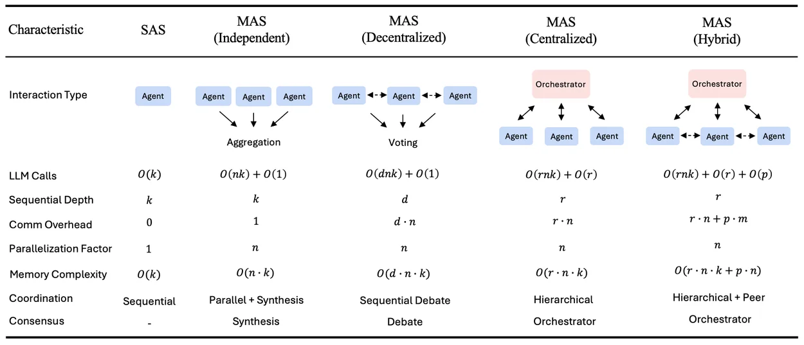
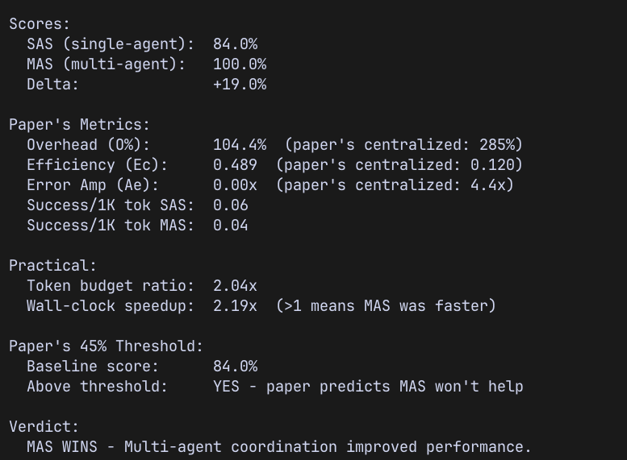

Everyone building AI agent systems right now assumes the same thing: more agents, better results. Split the work across specialized agents, let them collaborate, and the output improves.

A [research paper from Google Research, DeepMind, and MIT](https://arxiv.org/abs/2512.08296) tested that assumption across 180 controlled configurations, three LLM families (OpenAI, Google, Anthropic), and four benchmarks. The average performance improvement from multi-agent systems was **-3.5%**. Not positive. Negative.

The range was massive. From +80.8% improvement to -70% degradation. Multi-agent coordination isn't universally better or worse. It depends entirely on the task structure, the architecture, and the model capability. And the paper tells you exactly when each applies.

## The three scaling laws

The paper identifies three dominant effects that govern multi-agent system performance. These aren't suggestions. They're empirical findings backed by statistical significance across 180 experiments.

**The tool-coordination trade-off.** Tasks that use many tools (file I/O, code execution, API calls) suffer disproportionately from multi-agent overhead. The coordination tax compounds with environmental complexity. The more tools involved, the worse multi-agent performs relative to a single agent.

**Capability saturation.** When a single agent already achieves more than roughly 45% accuracy on a task, adding more agents produces diminishing or negative returns. The coordination overhead costs more than the marginal improvement additional agents provide. Current frontier models (GPT-5, Claude Sonnet 4.5+, Gemini 2.5 Pro) are good enough at many tasks that this threshold gets hit constantly.

**Architecture-dependent error amplification.** Independent agents (working in parallel with no coordination) amplify errors 17.2x compared to a single agent. Centralized coordination (one orchestrator managing sub-agents) contains that to 4.4x. The difference between these two numbers is the difference between a useful system and a catastrophic one.

## The task structure problem

This is the paper's most important finding and the one most people will ignore.

The paper tested four types of tasks. Financial reasoning, where subtasks are naturally parallelizable (analyze revenue, analyze costs, analyze market trends, then synthesize). Web browsing, which benefits from parallel exploration. Workplace task automation, with structured tool use. And sequential planning, where each step depends on the previous one.

Financial reasoning saw +80.8% improvement with centralized multi-agent coordination. The subtasks are genuinely independent. One agent researches regulatory filings while another analyzes cost structures while a third evaluates market trends. The orchestrator synthesizes. Every agent contributes unique information.

Sequential planning saw -39% to -70% degradation across every multi-agent variant tested. Every single one made things worse. The paper's execution traces show why. A single agent crafting an item in Minecraft follows a direct path: search recipe, gather materials, craft. Three turns, done. A multi-agent system decomposes this into artificial subtasks: Agent 1 researches the recipe (redundant, it's an instant lookup). Agent 2 checks inventory (redundant, the state is visible). Agent 3 executes the craft (the only necessary step). Three agents doing what one agent does better, plus coordination overhead eating into the token budget.

Software engineering sits uncomfortably between these two extremes. Some parts are parallelizable (implementing independent modules, reviewing different files, generating docs for separate components). But the overall flow is sequential: design, then implement, then test, then review. Each step depends on the previous step's output. You can't test code that hasn't been written. You can't implement an API that hasn't been designed.

So the question for anyone building agent systems for software engineering isn't "should I use multi-agent?" It's "which specific subtasks within this workflow are genuinely independent, and is the parallelization gain worth the coordination cost?"

## Why architecture matters more than agent count

The paper tested five architectures: single agent, independent (parallel with no communication), decentralized (peer-to-peer debate), centralized (orchestrator manages sub-agents), and hybrid (orchestrator plus peer communication).

The results aren't close.

| Architecture | Error amplification | Overhead | Best result |
|---|---|---|---|
| Single agent | 1.0x (baseline) | 0% | Best for sequential tasks |
| Independent | 17.2x | 58% | Almost never wins |
| Decentralized | 7.8x | 263% | Web navigation (+9.2%) |
| Centralized | 4.4x | 285% | Financial reasoning (+80.8%) |
| Hybrid | 5.1x | 515% | Over-coordinated, diminishing returns |

Independent agents are the worst option for almost every task. They duplicate errors without correction. No communication means no error catching, no synthesis, no verification. This is worth emphasizing because many "multi-agent" demos in the wild are just independent agents running the same prompt and picking the best answer.

Centralized coordination works best for structured, decomposable tasks. The orchestrator acts as a verification bottleneck that catches errors before they propagate. It reduces logical contradictions by 36% and context omissions by 67% compared to independent agents.

Hybrid sounds like it should be the best of both worlds. It isn't. The 515% overhead means agents spend more time coordinating than reasoning. The paper identifies an optimal coordination band of 200-300% overhead. Below 100%, coordination mechanisms aren't engaged enough to help. Above 400%, the system is over-coordinated. Centralized sits right in the sweet spot at 285%.

The paper also found that communication has a saturation point. Message density (messages per reasoning turn) plateaus at about 0.39. Beyond that, additional messages add noise, not signal. More talking doesn't mean better collaboration.

## The sub-agent finding nobody expected

The paper ran heterogeneity experiments, mixing different capability models within the same team. For Anthropic models specifically, a configuration with a **weaker orchestrator and stronger sub-agents outperformed a homogeneous team of strong models by 31%**.

Sub-agent capability matters more than orchestrator capability.

This makes sense when you think about what each role does. The orchestrator decomposes tasks and synthesizes results. That's coordination work, not deep reasoning. The sub-agents do the actual problem-solving, code generation, and analysis. Capability matters where the hard thinking happens.

The practical implication: use a cheaper, lighter model for the orchestrator and spend the budget on capable sub-agents. In an Anthropic stack, that means something like Haiku for orchestration and Sonnet for sub-agents. The orchestrator doesn't need to be brilliant. It needs to be organized.

## The 45% threshold

The paper derives this from a mixed-effects regression model (R-squared = 0.524, 87% architecture selection accuracy on held-out configurations). When single-agent performance on a task exceeds roughly 45%, multi-agent coordination yields diminishing or negative returns.

The mechanism is straightforward. If a single agent already handles the task reasonably well, the coordination overhead of splitting the work across multiple agents costs more than the marginal improvement those agents provide. The token budget gets fragmented. Each agent gets less reasoning capacity. The orchestrator burns tokens on task distribution and result synthesis. And the final output is often no better, sometimes worse, than what one focused agent would have produced.

This creates a moving target problem. As foundation models get more capable, more tasks cross the 45% threshold. Tasks that benefited from multi-agent coordination last year might not benefit this year because the single-agent baseline improved. The paper's out-of-sample validation on GPT-5.2 (released after the study) confirmed this: architecture-specific advantages narrowed at higher capability levels.

For software engineering tasks, current frontier models are already quite capable at generating individual modules, writing tests, and reviewing code. The single-agent baseline for many common tasks is probably above 45%. Which means multi-agent coordination for those tasks is likely neutral or harmful.

## What this means for building agent systems

The paper doesn't say multi-agent is useless. It says multi-agent is a tool that works under specific, measurable conditions. The conditions are:

**The task must be genuinely decomposable into independent subtasks.** Not artificially decomposed. Not sequential work split into fake parallel tracks. Actually independent, where each subtask produces unique information that doesn't depend on another subtask's output.

**The single-agent baseline matters, but the 45% threshold isn't absolute.** The paper found coordination yields negative returns above 45%. My experiment showed a +32.6% gain at a 75% baseline, though the task was specifically designed for perfect parallelizability. Measure the baseline first regardless. Always.

**Use centralized architecture.** An orchestrator managing 3 sub-agents with structured communication. Not independent agents. Not peer-to-peer debate. Not hybrid. Centralized, with the orchestrator acting as both task distributor and quality gate.

**Keep teams small.** The paper shows turn count scales as n to the power of 1.724. Beyond 3-4 agents, per-agent reasoning quality degrades because the token budget gets spread too thin. Three agents is the practical ceiling for most tasks.

**Keep tools minimal.** The tool-coordination trade-off means tool-heavy agents suffer most from multi-agent overhead. Give each agent only the tools it needs. Four tools per agent works. Sixteen doesn't.

**Spend on sub-agents, not the orchestrator.** A weaker orchestrator with stronger sub-agents outperforms a homogeneous team. Put the capable model where the hard reasoning happens.

## Testing it on code generation

The paper didn't test software engineering. So I ran the experiment myself.

The task: build a REST API with three independent resource modules (users, products, orders) using Express and TypeScript. Each module needs routes, types, validation, and an in-memory store. The modules have zero dependencies on each other.

Two configurations, same task. First, a single Claude Sonnet 4.6 agent with a 16,000 output token budget. Second, a centralized multi-agent system: Claude Haiku 4.5 as orchestrator, three Claude Sonnet 4.6 sub-agents running in parallel, same total budget split across them. The orchestrator designs shared conventions, distributes work, and synthesizes the result.

Both runs tracked the paper's coordination metrics.

## The results

| | Single Agent | Multi-Agent (Centralized) |
|---|---|---|
| Overall Score | 75.4% | 100.0% |
| Module Quality | 86% per module | 100% per module |
| Expected Files Present | 3 of 15 | 15 of 15 |
| Wall-clock Time | 106.7s | 47.8s |
| Total Tokens | 11,635 | 28,948 |

The single agent scored 75.4%. Well above the paper's 45% threshold where multi-agent is supposed to stop helping. The paper's prediction: MAS should not help here.

Multi-agent scored 100%. Every expected file present, every module complete, every evaluation criterion met. And it did it in less than half the time, because the three sub-agents ran in parallel.

The coordination metrics tell the rest of the story:

| Metric | Experiment | Paper's Centralized |
|---|---|---|
| Delta (MAS vs SAS) | +32.6% | Task-dependent |
| Overhead | 148.8% | 285% |
| Coordination Efficiency | 0.402 | 0.120 |
| Error Amplification | 0.0x | 4.4x |
| Wall-clock Speedup | 2.23x | N/A |

Overhead was 148.8%, roughly half the paper's centralized benchmark of 285%. Coordination efficiency was 3.3x higher than the paper's centralized figure. Error amplification was zero. The multi-agent system didn't amplify errors, it eliminated them.

A second run confirmed the pattern. The single agent scored higher this time (84% vs 75.4%), but multi-agent still hit 100%. Delta narrowed to +19%, but the direction held. MAS won both times.

## Why multi-agent won here

The single agent generated 16 files and the code quality was genuinely good, 86% per module. But it organized the files its own way. It named them `users.router.ts` and `users.types.ts` instead of the specified `router.ts` and `types.ts` nested under each module directory. The code worked. The structure didn't match the spec.

The multi-agent system nailed the file structure because each sub-agent received tight, explicit instructions from the orchestrator's shared context. When you tell one agent "build everything," it makes its own organizational decisions. When you tell three agents "build exactly this module, put the files exactly here, follow exactly these conventions," they follow the spec.

This is the real finding. The multi-agent advantage here wasn't about intelligence or capability. It was about constraint specificity. Each sub-agent had a narrower scope, clearer instructions, and less room to drift from the requirements. The orchestrator's job was to define those constraints upfront.

## What challenges the paper, and what doesn't

This result challenges the paper's 45% threshold prediction. Across two runs, the single-agent baseline scored 75.4% and 84%, both well above 45%. Multi-agent hit 100% both times, with deltas of +32.6% and +19%. But there are important caveats.

Two runs aren't 180 controlled configurations. The paper derived statistical significance across its experiments. Two data points show a consistent direction, but they don't prove it.

The token budgets weren't perfectly matched. The single agent used 11,635 total tokens. The multi-agent system used 28,948. Output tokens were capped for both, but input tokens (the prompts and context sent to each agent) weren't. The orchestrator's shared context gets sent to every sub-agent, inflating the total. A stricter budget-matching protocol might narrow the gap.

The file naming penalty hit the single agent harder than it arguably should have. The code was good. The organization was different from what was specified. A human reviewer would score it higher than the automated evaluator did.

But the findings that hold up regardless of these caveats: multi-agent was 2.2x faster due to parallel execution, error amplification was zero (the paper predicted 4.4x for centralized), and the overhead was well within the paper's optimal band. The task structure, genuinely independent modules with zero cross-dependencies, is exactly the type the paper says benefits most from coordination.

The paper's core insight still stands. Task decomposability determines everything. This task was designed to be perfectly parallelizable, and multi-agent won. A sequential variant of the same task (design, then implement, then test) would almost certainly degrade with multi-agent, just as the paper predicts.

## What actually matters

The paper's predictive model gets the right architecture 87% of the time using task properties alone. My experiment landed in the other 13%, or at least appeared to. But it didn't really contradict the paper. The paper's strongest finding is that task decomposability determines success, and my task was designed to be perfectly decomposable.

The real takeaway isn't "multi-agent is better" or "single agent is better." It's that this is a measurable question with a measurable answer, and the answer changes based on what you're building.

For practitioners building agent systems today: measure your single-agent baseline before adding coordination. Decompose only where subtasks are genuinely independent. Use centralized architecture with small teams. Keep tools minimal. Put model capability in the sub-agents, not the orchestrator.

And the one thing the paper and the experiment agree on completely: if your task is sequential, don't use multi-agent. Every multi-agent variant tested on sequential tasks made things worse. No exceptions.
