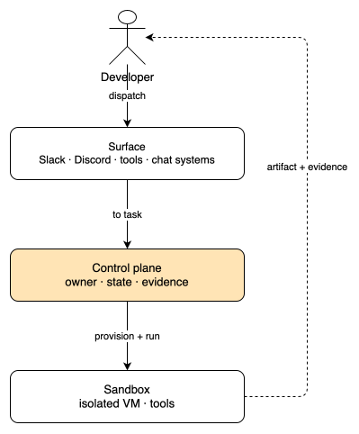
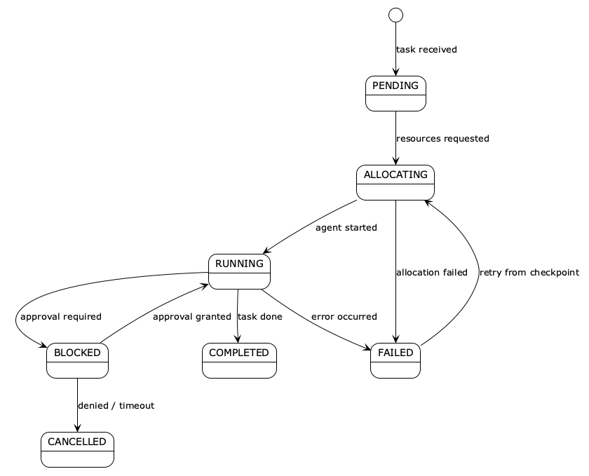
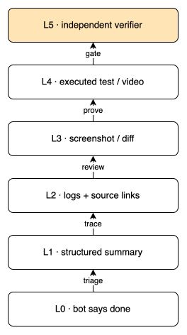
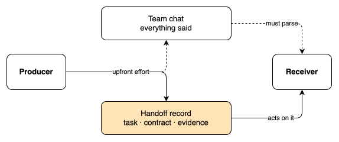

People keep asking which chat app agents are going to win. Teams, Slack, Discord, or a custom GUI. A team moving to agents picks a surface before it has anything to put behind it. I think the question is backward. The chat app is just where the dispatch message lands, and agents stopped being chat apps a while ago.

xAI's Grok bot team made this concrete. Each bot gets an isolated computer in the cloud, its own memory, its own tools. You message it like a colleague. It keeps working while your laptop is closed, and it comes back when it has progress to show or a decision it can't make alone. Cursor sells the same shape: [cloud agents that run in isolated VMs](https://cursor.com/docs/cloud-agent), build, test, and drive real software, then hand back merge-ready pull requests with screenshots, logs, and video.

The old unit of interaction was the prompt. You open an app, type, get an answer, close. The new unit is the outcome. You give an agent a responsibility, it holds it across time, operates a real environment, and reports back when there is meaningful progress or it needs a decision. Once that is the shape, the chat app is only where the message lands.

## the control plane is a layer, not a surface

Every agent system I have seen runs into the same handful of decisions: who owns the next step, what counts as done, what evidence lets a task advance, and where a human has to decide. That set of decisions is the control plane, and none of it lives in a chat app.

Forrester already carved this up for enterprise architecture as three planes. The build plane is where work gets created. The orchestration plane coordinates it. The control plane governs it with a registry of what agents exist and can do, policy enforcement, budgets, kill switches, and a durable audit. Slack is where the dispatch message arrives. The control plane decides whether a message became a task, who owns it now, and what proves it is finished.

The Grok playbook for [bot systems engineering](https://luma.com/38zzy3ov) makes the state concrete. A workflow needs six invariants to be runnable: one current owner, explicit state, a durable artifact, observable evidence, a bounded retry policy, and a clear approval boundary. The minimal observable state for any task is a task id, the owner, a status from a fixed set (queued, running, waiting, verifying, done, escalated), the artifact, the evidence, and the next deadline. That record is what a control plane actually keeps.

The state machine for one session is a small, boring graph. A task arrives, resources get requested, the agent runs. Nearly everything moves on its own. The one edge that needs a person is approval: *running* blocks for it, a *denied* or a timeout cancels the task, and a failure retries from a checkpoint instead of starting over.

Nothing about this requires Teams or Discord. It does not even require the developer and the agent to share a room.

## where developers actually dispatch from today

The answer to "is it still IDEs?" is both, and the split keeps moving. The IDE is the deep-supervision surface, where you watch a long task unfold and steer it. Dispatch happens wherever the work already lives.

Cursor's [own docs](https://cursor.com/docs/cloud-agent) list the current options: the desktop app, the web, the iOS app, Slack with an @cursor command, a comment on a GitHub PR, a task in Linear, or the API. That list is the interesting signal. Work gets launched from the place where the person already is, and the agent reports back to that same place with artifacts and evidence. The chat thread or the PR is the interface. The orchestration and the machines sit behind it.

For code work specifically, the environment is doing more of the work than the model. Cursor says it plainly: an agent that can write code but cannot run tests cannot close the loop. Its [cloud agent setup](https://cursor.com/docs/cloud-agent/setup) is a Dockerfile or snapshot behind environment.json, with secrets managed separately, outbound domains restricted, and private networks reachable over Tailscale. The VM handles provisioning, isolation, snapshots, and capacity. The result is an agent running steps in parallel across multiple repositories while your machine is off. That is how "works while the laptop is closed" actually happens: not a richer prompt, a managed environment.

## verification is the bottleneck, not the model

Once an agent can act, the question becomes how you trust what it did. The playbook's [evidence ladder](https://cursor.com/docs/cloud-agent/capabilities) breaks that trust into levels. Level 0 is "the bot says it is done," which is never sufficient. Level 1 is a structured summary, enough for triage. Level 2 adds logs or source links for traceability. Level 3 is a screenshot or diff for review. Level 4 is an executed test or video, which is behavior proof. Level 5 is an independent verifier pass, the gate you actually want before you walk away.

Two rules matter here. The producer and the verifier have to be separate, because the worker that made an artifact has context and incentives that bias its judgment; the verifier reports failures without silently rewriting the output. And the loop is not complete until work either reaches a defined finish state or escalates with a reason. "Done" and "looks good" and "I handled it" do not advance a production workflow. The receiver has to be able to open the artifact and run the named check. This one rule eliminates most false-positive completions.

## a typed handoff is smaller than a team chat

When a system does use multiple agents, the interface between them is not a conversation. The playbook's [handoff record](https://cursor.com/docs/cloud-agent) carries a task id, the producer, the named next owner, the artifact, the contract or acceptance test, the evidence already produced, assumptions, open risks, and a deadline. A receiver can act on that without reading the producer's full transcript. Shared state is a compact ledger of task state, artifact pointers, and evidence, not a shared memory of everything everyone said.

Parallelism follows the same logic. The playbook recommends starting at three or four simultaneous specialists for one workflow, and that number is not a product limit. It is an observability limit. A human should still be able to say why each worker exists and how its output merges. Scale the verifier before you scale the workers. Four workers produce four times the output and more than four times the review burden, and if the verifier cannot reject incomplete work automatically, you have just moved the bottleneck to a human comparing ten long answers.

## what this means if you build it

This is the shape I put into [Foreman](https://github.com/AssahBismarkabah/Foreman). It dispatches tasks from Slack or Discord, provisions an isolated sandbox in the cloud, runs the agent, and reports results back to the channel with evidence. The chat is the surface. The control plane is the code that turns a message into a task with an owner and a status, provisions the sandbox, and returns the artifact. You type a task where you already talk to your team, an agent works somewhere else, and the result comes back to the same thread.

The build order that has held up for me and in the playbook is deliberately small. Map one recurring workflow and run it manually three times before any agent exists. Add one bot and one skill, and watch every action until five runs pass. Add a routine with an idempotency key so duplicate triggers cannot double the work. Add a manager only when routing is the actual bottleneck, and start with two specialists, not a team. Add a verifier before you add parallel workers. Every step is measured against completion, rework, interruptions, recovery time, and cost per verified result, and you change one variable at a time.

Which chat app you pick is the easy decision, and it's the reversible one. Pick a surface where your team already lives; it will be replaced when the tooling moves again. The expensive decision is the layer underneath: who owns each step, what evidence advances it, and where a human has to decide. That layer outlives every surface, so it's the one worth building.
