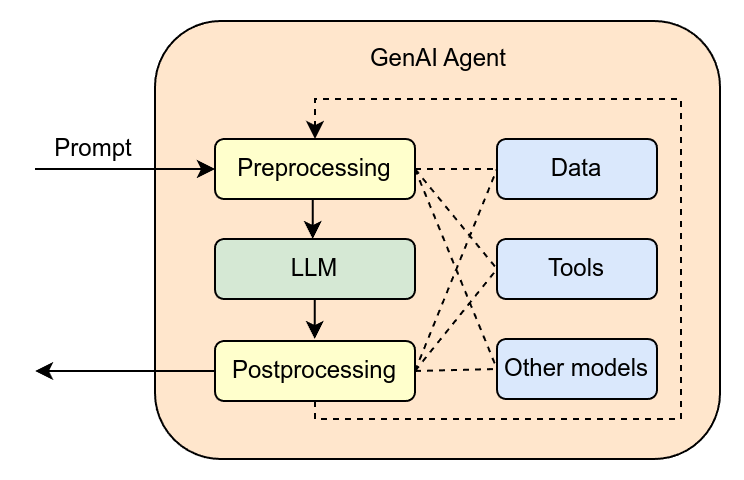
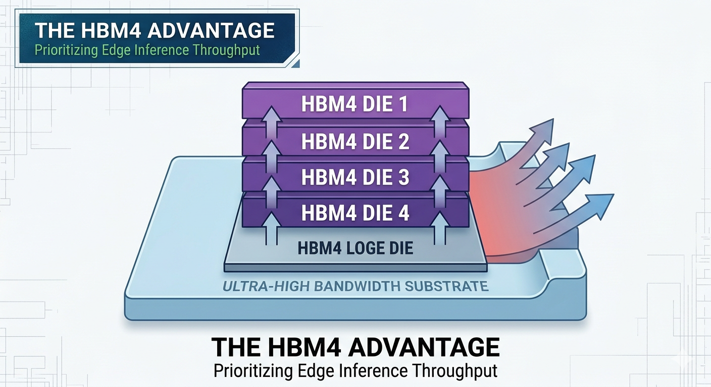

# There Is No AI Thinking (And You Can't Outsource It)

We have officially entered the era of Inference-at-Scale. The marketing hype surrounding "Artificial Intelligence" has never been louder, bolstered by the deployment of [NVIDIA's Rubin](https://en.wikipedia.org/wiki/Rubin_(microarchitecture)) architecture and the rise of Agentic Ecosystems. These systems don't just answer questions. They operate autonomously in complex environments, executing multi-step plans with minimal human intervention.

But even as these machines manage our supply chains and generate marketing solutions, we need to confront a fundamental truth that the hardware and software layers often obscure: AI does not think. It calculates.

## The Illusion of the "Thinking" Machine

The greatest category error of our time is mistaking [generative outputs](https://en.wikipedia.org/wiki/Generative_artificial_intelligence) for cognitive intent.

Modern AI is a masterpiece of [pattern recognition](https://en.wikipedia.org/wiki/Pattern_recognition) and predictive modeling. When an agent "decides" on a course of action, it is not weighing moral consequences or contemplating original ideas. It is executing a high-dimensional, [rule-based mapping](https://grokipedia.com/page/Rule-based_system) between its perception of a state and a condition-action rule.

Look at the architecture of a GenAI Agent. A prompt goes in, gets preprocessed, runs through an LLM, gets postprocessed, and comes out the other end. Along the way it can pull from data sources, call tools, even invoke other models. Impressive plumbing. But at no point in that pipeline does anything resembling thought occur. It is computation. Sophisticated, layered, fast computation. But computation nonetheless.

[John McCarthy](https://en.wikipedia.org/wiki/John_McCarthy_(computer_scientist)) defined AI as the "science and engineering of making intelligent machines." The "intelligence" we see today is strictly computational. It is an algorithmic prediction of the most likely successful outcome based on massive datasets. Not an act of thought.

## The "Rubin" Era: Speed Over Soul

The hardware powering 2026 is designed for one thing: throughput.

[NVIDIA's Rubin GPUs](https://grokipedia.com/page/nvidia-vera-rubin-nvl72) and HBM4 memory have prioritized "Inference at the Edge," allowing models to run faster and more locally than ever before. The architecture is built around ultra-high bandwidth substrates and stacked memory dies, all optimized to push inference throughput to its absolute limit.

This increased computing power has created what I think of as a "Trust Loop." Because the machine is fast and often correct, we are tempted to abdicate the hardest part of any job: the actual thinking.

But efficiency is not wisdom. A machine can optimize a schedule, but it cannot understand the "why" behind a pivot. It can process a cultural dataset, but it cannot feel the emotional weight of a cultural shift. Speed makes the loop tighter. It does not make the output wiser.

## Why You Can't Outsource the Core

In an era where [Agentic AI](https://en.wikipedia.org/wiki/AI_agent) prioritizes decision-making over mere content creation, the temptation to "set it and forget it" is a strategic trap. You cannot outsource the three things that define human leadership:

**Taste.** AI can generate "new" solutions based on information it has been fed, but it cannot recognize the soul of a brand or the subtle resonance of a masterpiece. Taste is a human filter, not a statistical average.

**Judgment.** Simple reflex agents follow "if condition, then action" rules. Human judgment lives in the gray space where the rules don't apply. The "Novelty Collisions" where data provides no precedent.

**Accountability.** An algorithm bears no consequences. You can outsource the task, but you can never outsource the responsibility for the outcome.

## The Architect vs. the Calculator

The SOTA models of 2026, whether Generative AI, Natural Language Processing, or Computer Vision, are the most powerful calculators ever built. But they are still just that. Calculators.

In this automated landscape, the most valuable person in the room is the one who refuses to stop thinking. The machine provides the map. You provide the destination.

Stop waiting for the AI to "think" for you. It is just math. And it is only as good as the human intent behind it.
