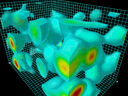
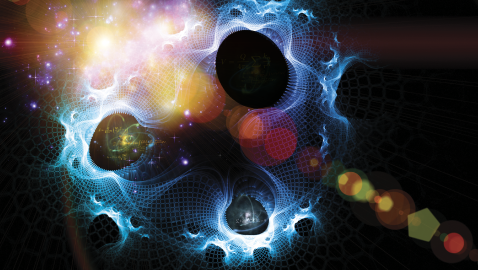

It is safe to argue that humans have existed for millennia. The cosmos and the galaxy are far beyond our reach. We can speculate about life on other planets, probe the edges of what is observable, send signals into the void. But the core idea of meaning does not leave the human heart. It is a long quest. Centuries have passed and that craving has not faded.

There have been concepts of humans evolving from hominins and ancestors, research tracing our biology back through the species. And some of that makes sense. But the explanation for the craving in the human heart, why we are qualitatively different from other species, still cries out in many hearts. Biology explains the body. It does not explain the ache.

Meaning seems to be like a stream that does not go away. Some have found a way to craft meaning for themselves. But beneath the surface, the heart still cries.

## The manufacturer thought

Here is what shifted things for me. It is a simple idea but it will not leave me alone.

A fan cools a room. Not because it decided to. Because whoever made it designed it that way. A battery powers a car. Not by choice. By design. Take the battery out of the car and it just sits there. It still has everything it needs to function, but disconnected from the system it was made for, it does nothing.

Now think about us.

If there is a God, and I believe there is, then we did not show up by accident. We were made. And if we were made, then the one who made us is the only one who actually knows what we are for. Not our parents. Not our culture. Not the career counselor. Not even ourselves.

The purpose is not ours to invent. It is ours to know.

That distinction changes everything. Because most of us are running around trying to *create* meaning out of achievements, relationships, status, whatever we can grab. And it works for a bit. Then it does not.

## Accepting a manufacturer

Accepting that there is a manufacturer is, for some, an infinite quest in itself. But the reality and the system of things express it in different possible ways. Creation itself cannot occur without a creator, the same way many things around us exhibit this.

Now science has its responses. The [Schwinger Effect](https://en.wikipedia.org/wiki/Schwinger_effect). [A Universe from Nothing](https://en.wikipedia.org/wiki/A_Universe_from_Nothing). Quantum Fluctuations. The [Casimir Effect](https://en.wikipedia.org/wiki/Casimir_effect). Cosmological models built on the idea that something emerged from nothing. But at its core, all of these explanations are based on fields. We put equations on a field as our basis of explanation, which is shallow when you really look at it. We cannot see fields. But because we think they are the [only explanation for things we can see](https://www.quora.com/How-do-physicists-know-that-quantum-fields-exist), we conclude that fields are the fundamental fabric of reality.

We used to think atoms were the bottom floor. Then we found protons and electrons. Then we found quarks. Now, we see that those particles are just "ripples" in the fields.

From first principles, we cannot dig deeper. And even if we could, we would not be able to fully understand the universe from inside it.

Here is the thing. What physics calls "nothing" is actually a Quantum Field, a complex, law-governed fabric of energy. Logic tells us that nothing comes from nothing. So if these fields exist with such mathematical precision and "jiggle" to create matter, they cannot be their own cause. Arguments of randomness or a multiverse fail because even a random lottery requires a pre-existing machine and rules to function. To have a dice roll, you first need dice and rules for how they land. Randomness is a process, not a creator.

We are like characters in a software program. We can see the code. We can study the physics. But we cannot see the Programmer because He is not made of the code. Asking "who designed the Designer?" is a mistake of logic. The Designer exists outside the system of time and cause-and-effect that we are trapped in. He is the First Cause who does not need a beginning.

And when we see a design, like a field that perfectly balances charges so matter can exist, we infer a Designer. The precision is too intentional to be accident.

Humanity is not an experiment. It is a design. The "nothing" that science references is not empty. It is a canvas that was already prepared. The particles "appearing" are just the execution of the design. Discovering the Schwinger effect or the Casimir effect is not proving that nothing becomes something. It is humans finally learning how to read the blueprints. Science is not replacing the Designer. It is studying the craftsmanship.

## The problem with making your own meaning

There is a well-known idea that meaning can be found through three things: creative work, deep relationships, or the dignity of enduring suffering. And honestly, there is truth in it. People who have a reason to keep going tend to survive things that would break others.

But here is where it falls short for me. If meaning is just something we choose, if it is a story we tell ourselves to keep moving, then what happens when the story stops working? When the relationship ends. When the creative work feels hollow. When the suffering has no resolution.

You are left holding a meaning you built with your own hands. And your hands are not steady enough for that.

It is like a kid playing with a tool he does not understand. He finds his own use for it, maybe he bangs it on the table, makes some noise, has some fun. But he is missing the actual function. The thing was made for something specific, and until someone shows him what that is, he is just playing.

That is us. Playing with our lives. Finding temporary uses. Missing the design.

## What I see when I look at creation

I do not think this is just theology. I think the evidence is right in front of us.

A tree does not decide to produce oxygen. The moon does not choose to reflect light. These things fulfill their function because they were designed to. No one argues with this. We accept it immediately for everything in nature, everything except ourselves.

We look at a plant and say "it was made to do that." We look at ourselves and say "I will figure it out on my own."

That is strange to me.

Our fingerprints are unique. Our voices are unique. Our specific combination of abilities, instincts, passions, all unique. Not random. I do not buy random. There is too much specificity for it to be noise.

## Moses almost got it right

There is a story that stays with me. Moses, born with this instinct to deliver, to free people. He felt it so strongly that he killed a man over it. He acted on the right instinct in completely the wrong way, at completely the wrong time.

Then forty years in the desert. Forty years. And then God showed up and said: that thing you felt? That was real. But it is mine to direct, not yours to execute on your own terms.

His purpose was always there. But it was not his to invent. It was his to receive.

Paul is the same story from the opposite direction. A man so committed to the wrong cause that he was literally hunting down the people of God. Then one encounter on a road, and everything flipped. Not because he figured it out. Because it was revealed to him.

These are not fairy tales to me. These are patterns. Purpose that was always there, but only became clear through contact with the one who put it there.

## The thing nobody wants to hear

The uncomfortable part is that this means we cannot just do whatever we want and call it purpose. There is a standard that is not ours.

The world tells you: follow your passion, find your truth, create your own meaning. And I get the appeal. It puts you in the driver's seat. It feels empowering.

But I have watched people follow their passion straight into emptiness. I have watched people build entire lives around goals that were never theirs, inherited from parents, from culture, from the pressure to look successful, and then weep at what they built. Not because they failed. Because they succeeded at the wrong thing.

The difference between busyness and purpose. Between motion and progress. It looks the same from the outside. It feels completely different on the inside.

## Beyond the grave

Here is where this gets real for me. If purpose is just something we create, it ends when we do. You live, you find some meaning, you die. That is it. And maybe that is fine for some people.

But I do not think that is the full picture. I think there is a dimension to this that goes beyond what we can measure. The soul knows things the mind does not. The spirit reaches places the body cannot.

We are not sparks in the void. We are not biological accidents trying to justify our existence with philosophy. We are made. By someone. For something. And that something does not expire.

## So what do you do with this

You turn to the manufacturer. That is it. Not to a system, not to a religion as a cultural identity, not to rituals for the sake of rituals. To the actual God who made you and knows what you are for.

It starts with relationship. Not information, relationship. You can read every theology book ever written and still not know your purpose. But spend time with the one who designed you, and it starts to become clear. Not all at once. Not on your schedule. But it comes.

And when it does, the restlessness quiets. Not because your circumstances changed, but because you stopped trying to be something you were not designed to be. You stopped playing the violin like a drum. You started making music.

That is the difference. And once you hear it, you cannot unhear it.
