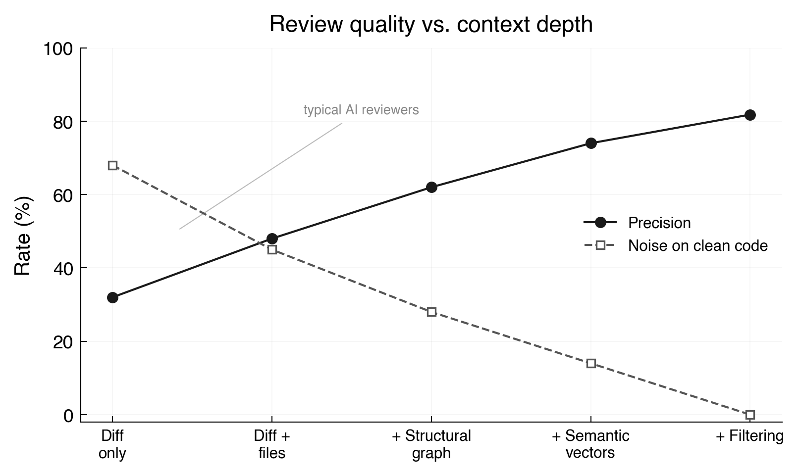
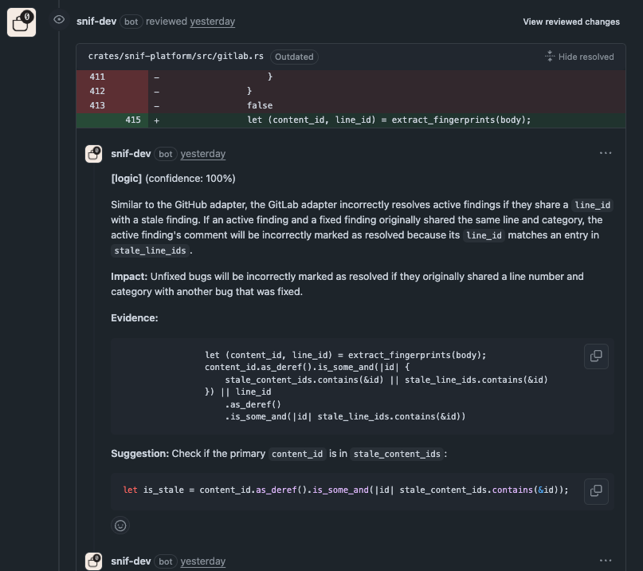
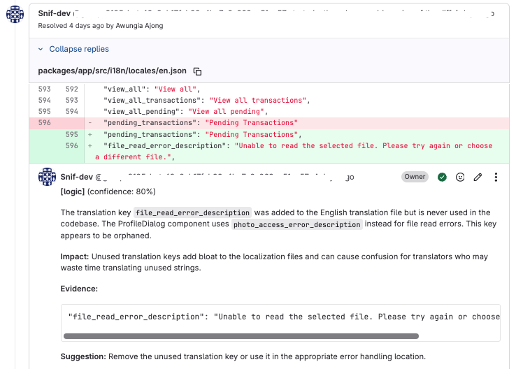

I spent some time researching every AI code review tool I could find. CodeRabbit, Greptile, Qodo merge, Copilot and lots of others, half a dozen smaller ones. The pattern I saw seems to be the same, teams install these tools, get excited with the feedback they provide, then disable them after some time.

The comments are generic. The tool flags things that don't matter. It misses things that do. Every push creates new comments even when nothing changed. Developers learn to ignore it, and once trust is gone, the tool is dead.

This is the same pattern across the entire category. It does not matter which model powers the tool. GPT-5.3, Claude Opus, Gemini, they can all find real bugs when given the right context. The problem is everything around the model. What context goes in. What comes out. How it gets filtered. How it gets published. Whether it learns.

The model is the least interesting part of this problem.

## the systems problem

Think of it like this. A senior engineer reviewing a PR does not just read the diff. They know the codebase. They know that this module has a pattern for error handling and the new code does not follow it. They know that the function being changed is called from a critical path. They know that the last time someone touched this file, it broke production for two hours.

An AI reviewer that reads only the diff is doing the equivalent of asking a contractor to review your code on their first day. They can spot syntax issues and obvious bugs, but they cannot tell you if the change breaks something three modules away.

The fix is not a better model. The fix is a better system around the model. Context assembly, output filtering, annotation lifecycle, evaluation. That is the stack that actually matters.



The relationship is measurable. Diff-only review produces roughly 30% precision with 70% noise on clean code. Each layer of context, structural graph, semantic vectors, output filtering, moves the needle. By the time the full retrieval and filtering pipeline runs, precision reaches 82% and noise drops to zero on clean changes.

## what greptile got right

Greptile understood the context problem early. They build a graph of the entire repository, every function, class, and dependency, then generate AI summaries that get embedded as vectors for semantic search. When a PR comes in, they query the graph and the vectors to find related code, then send all of that as context to the model.

Their approach works. The model sees the blast radius of a change. It sees similar patterns elsewhere in the codebase. It sees the conventions the team follows.

The limitation is the architecture. Greptile is a hosted service. Your code goes to their servers. They maintain the vector database, the graph infrastructure, the webhook listeners. For enterprise teams with data sovereignty requirements, that is a non-starter.

I studied their approach and built the same capability into a single binary.

## snif

[Snif](https://github.com/AssahBismarkabah/Snif) is an open source code review agent that ships as a single Rust binary. No hosted service. No external vector database. No code leaving your network.

It indexes the repository once per commit into a local SQLite database. Tree-sitter parses every source file and extracts the structural graph, imports, symbols, references. An LLM generates natural language summaries of every function and file, which get embedded as vectors for semantic search. Git history analysis reveals co-change patterns the import graph misses.

When a PR arrives, Snif retrieves related code using three methods in parallel: structural graph traversal for blast radius, semantic vector search for pattern matching, keyword search for exact references. The results are merged, ranked by configurable weights, and fit within a token budget.

Then it calls the model once, parses the structured output, filters aggressively, and posts findings.

## precision over volume

Most tools default to showing more results because it looks like the tool is working harder. In practice, noise erodes trust faster than silence.

Every finding Snif produces must cite specific evidence from the provided code. Every finding must explain the user-relevant impact. Speculative findings are rejected. Style-only findings are suppressed unless the team explicitly configures them as enforced. Duplicate findings at the same location keep only the highest confidence.

I validated this against 25 benchmark fixtures,10 with known bugs, 10 clean changes, 5 style noise. Precision above 80%, recall at 90%, zero noise on clean changes. Quality gates block releases if precision drops below 70%.

The evaluation harness runs the same pipeline as production. Changes to prompts, models, or retrieval must pass the benchmark before shipping. This is not manual testing. This is automated quality gating on every change to the review system itself.

## comment churn kills trust

This is the part most tools get completely wrong. You push a change. The reviewer runs. Posts five comments. You fix two of them and push again. The reviewer runs again. Posts five new comments, three of which are the same issues, reworded.

That is how you train developers to ignore the tool.

Snif computes a stable fingerprint for every finding. The primary hash uses the file path, category, and normalized evidence text, the actual code snippet the model cited. This means the fingerprint survives rebases. If a file gets pushed down by ten lines, the fingerprint does not change because the evidence text is the same. If the developer fixes the bug, the evidence changes and the fingerprint changes with it. That is exactly the right behavior.

A secondary line-based hash provides backward compatibility with prior comments. On each run, Snif fetches prior findings from the PR, matches current findings against them using both hashes, and resolves stale ones only when neither matches. Fix the issue and the comment resolves automatically. Push again without fixing and no duplicate appears.

## snif reviewing its own code

The most convincing test of any tool is whether it works on itself.

During development of the content-based fingerprinting feature, Snif reviewed its own PR and caught a real logic bug: the stale resolution code i implemented would incorrectly resolve active findings if they shared a line number with a fixed finding. The model cited the exact code, explained the cross-contamination path, and suggested the fix.



On a GitLab , Snif reviewed a merge request and caught an unused translation key that was added to the localization file but never referenced by any component. The finding included the evidence, the impact on translators, and the suggestion to remove it.



In another review, Snif flagged its own installation docs as a supply chain risk, the CI pipeline downloaded and executed a shell script from GitHub without integrity verification. That finding led me to add Sigstore cosign keyless signing to every release. Each checksum file is now signed with GitHub Actions' OIDC identity and recorded in Sigstore's transparency log.

## what we learned

I ran three technical spikes before writing any product code. SQLite with sqlite-vec for unified storage, benchmarked KNN queries at 100ms for 50k vectors, 87MB database. Tree-sitter for structural parsing, 150 lines of adapter code per language, accurate extraction across Rust, TypeScript, and Python. Fastembed for local embeddings, 20 summaries embedded in 1.5 seconds, meaningful similarity results. I committed to the architecture only after proving every piece works with real numbers.

You cannot design a retrieval system by reading about retrieval systems. You have to build it, measure it, and see where the numbers actually land. The spikes were not optional. They were the only way to make informed architecture decisions.

The first evaluation run showed 25% precision. The natural assumption was that the model was wrong. It was not. The "clean" test fixtures had real bugs the model correctly caught. A function that sliced a UTF-8 string by byte index, panics on multi-byte characters. A log statement using `warn!` level for routine request parsing. The model caught issues the fixture author missed.

This is a lesson about confidence in your own assumptions. When the test says you are wrong, check the test before changing the code. Once I fixed the fixtures, precision jumped to 100%.

A 33-line diff touching `pnpm-lock.yaml` produced a 287k token prompt because Snif loaded the entire lock file as context. The pipeline log told us exactly what happened:

```
Context assembled changed=3 related=0 omitted=0 remaining_tokens=0
WARN Prompt still exceeds budget after removing all related files
  tokens=204815 budget=128000
```

Zero related files. All 204k tokens came from the three changed files alone. The lock file, hundreds of thousands of lines with no reviewable logic, consumed the entire budget. The fix was to detect non-reviewable files and skip their full content. The diff hunks are enough. Every major code review tool does this. I should have done it from the start.

I spent zero time on prompt engineering before the architecture worked end-to-end. The system prompt is 40 lines. The output schema is a JSON array with eight fields. That is the entire prompt layer. The quality comes from what goes into the prompt, what comes out of it, and what happens after. Retrieval, filtering, lifecycle. The model is a replaceable execution layer.

The model is a commodity. The system around it is the product. If your entire value proposition depends on which model you use, you have no moat. The moat is in the data pipeline, the evaluation framework, the deployment infrastructure, and the feedback loops.

[Snif](https://github.com/AssahBismarkabah/Snif) is open source under the MIT license. It supports GitHub and GitLab, reviews in Rust, TypeScript, Python, and Java, and works with any OpenAI-compatible LLM provider. All release artifacts are signed with Sigstore cosign and verified against the GitHub Actions OIDC identity.
